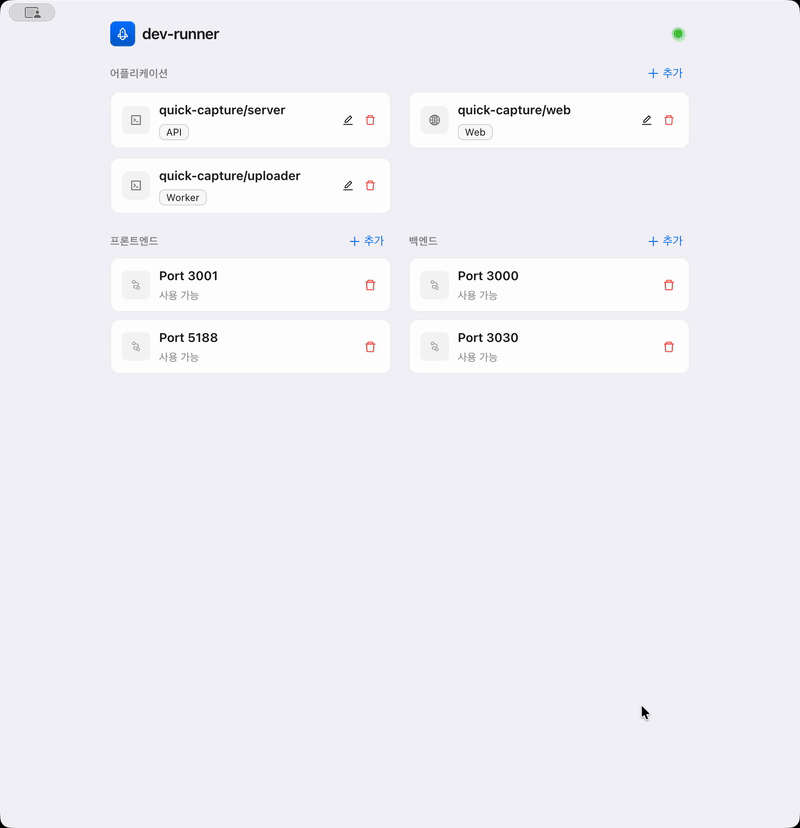

# dev (project auto launcher)

One command to detect your stack, install deps, pick a free port, and start the right dev process — in the foreground by default. Use `--tmux` to launch inside a tmux session.

## Quick start
```bash
npm install -g .

# run in any project root
dev                              # auto-detect + run (foreground, sequential)
dev --print                      # show what would run (no execution)
dev --port 4000                  # use a specific port
dev --env VITE_API_PORT=4000     # pass env vars to the process
dev --tmux                       # launch inside a tmux session
dev sessions                     # list tmux sessions started by dev
dev kill NAME                    # kill a specific dev tmux session
dev help                         # usage
```
Ensure your npm global bin directory is on `PATH` (`npm bin -g`).

## What it does
- Detects frameworks/runtimes:
  - **Node**: Next.js, Vite, Nuxt, SvelteKit, Remix, Expo, generic scripts, TypeScript server fallback (`src/index.ts` via ts-node), `dist/index.js`, or `index.js/server.js`.
  - **Python**: Django, FastAPI (uvicorn), Flask, generic `app.py/main.py`.
    - If `.venv/bin/python` exists, runs with that interpreter.
    - Else uses `uv run`. If neither `.venv` nor `uv` is available, exits with an error.
  - **Go**: `go run` (main.go / cmd/server/main.go / .).
  - **Java**: Gradle `bootRun`, Maven `spring-boot:run`.
- **Package manager**: chooses pnpm > yarn > bun > npm based on lockfiles; defaults to npm when only `package.json` is present.
- **Installs deps** (best effort): `pnpm|yarn|bun|npm install`, `uv sync`, `go mod download`.
- **Port handling**: starts from a sensible default (3000 for Node, 5173 for Vite/SvelteKit, 8000 for Django/FastAPI/Flask, 8080 for Go/Java), scans for a free port, falls back to an OS-assigned port; prints the final `PORT`. Vite and SvelteKit receive `--port` as a CLI argument (they don't read `PORT` env var).
- **Environment variables**: pass arbitrary env vars with `--env KEY=VALUE` (repeatable). Useful for Vite's `VITE_*` vars.
- **Output**: colorized step banners (Detection → Installing deps → Launching).

## Launch modes

| Command | Behavior |
|---|---|
| `dev` | Runs the first detected command in the foreground (default) |
| `dev --port 4000` | Forces port 4000; skips free-port scan |
| `dev --env KEY=VALUE` | Sets env var for the process (repeatable) |
| `dev --tmux` | Launches inside a new tmux session; splits panes for multi-command stacks |
| `dev sessions` | Lists all `dev-...` tmux sessions with paths, timestamps, and URLs |
| `dev kill <name>` | Kills a specific tmux session |

**Port priority:** `--port` flag > `PORT` env var > framework default (3000 / 5173 / 8000 / 8080).

### Environment variables

Use `--env` to pass environment variables to the dev process. This is especially useful for **Vite** apps that read `import.meta.env.VITE_*`:

```bash
# Single env var
dev --env VITE_API_PORT=4000

# Multiple env vars + custom port
dev --port 5188 --env VITE_API_PORT=4000 --env VITE_API_HOST=localhost
```

`--env` overrides take the highest priority — they win over both `process.env` and framework-detected env vars.

> **Multi-command stacks** (e.g. `dev:server` + `dev:client`): default mode runs only the first command. Use `--tmux` to run all commands in split panes.

## Web UI (Electron App)

`dev-runner` includes a beautiful desktop interface (Electron) for managing complex multi-service architectures visually.



### How to Run
```bash
dev ui
# or from source
npm start
```

### Key Features
- **Visual Dashboard**: View all your configured applications and ports at a glance.
- **Drag & Drop**: Assign applications to ports by dragging cards. Starting/Stopping is as simple as dropping an app on a port.
- **Log Viewer**: Integrated terminal output for each running process.
- **Smart Import**: Uses the same detection logic as the CLI to auto-configure new projects.

### Build & Distribution
To package the application as a standalone executable (e.g., `.dmg` or `.zip` on macOS):

1. **Build the frontend** (React/Vite):
   ```bash
   npm run build:frontend
   ```
2. **Package the app**:
   ```bash
   npm run dist
   ```
The output will be generated in the `dist/` folder.

---

## Requirements
- Node.js + npm (or your package manager)
- Optional: `tmux` (only needed for `--tmux` mode)
- Optional: `uv` for Python projects, `go` for Go, Java toolchain for Gradle/Maven

## Handy tmux commands (when using `--tmux`)
- Attach: `tmux attach -t <name>`
- List: `tmux ls`
- Kill: `tmux kill-session -t <name>`
- Move pane: `Ctrl-b` then arrow key
- Split: `Ctrl-b %` (vertical), `Ctrl-b "` (horizontal)

## Local (non-global) use
```bash
node dev.js           # run
node dev.js --print   # dry run
node dev.js --tmux    # tmux mode
```
or `chmod +x dev.js && ./dev.js`.

## Notes
- Dependency install failures emit warnings; the launcher still attempts to run.
- To add custom detection rules, edit `dev.js` and reinstall globally (`npm install -g .`).

## Zsh Completion

Add the completion script to your `fpath` or source it in your `.zshrc`.

**Method 1 (Recommended): Add to `fpath`**
```zsh
# Create a directory for completions if it doesn't exist
mkdir -p ~/.zsh/completions

# Add it to your fpath in .zshrc
echo 'fpath=(~/.zsh/completions $fpath)' >> ~/.zshrc
echo 'autoload -Uz compinit && compinit' >> ~/.zshrc

# Generate the completion script
dev completion > ~/.zsh/completions/_dev

# Reload shell
exec zsh
```
